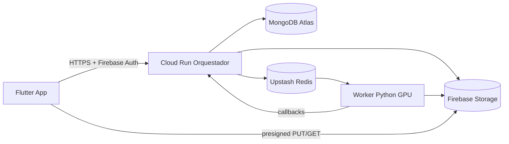

# Infraestructura de producción — MelodAI

**Guía operativa paso a paso:** [DESPLIEGUE_PROD_PASOS.md](DESPLIEGUE_PROD_PASOS.md) (checklist, Upstash, Cloud Run/Render, worker GPU).

Arquitectura objetivo según PRD:

| Componente | Servicio recomendado |
|------------|----------------------|
| App Flutter | Stores / instalador Windows (build con `API_BASE_URL` de prod) |
| Orquestador Node | **Google Cloud Run** (mismo proyecto Firebase/GCS) o Render |
| MongoDB | **MongoDB Atlas** (M10+ según carga) |
| Cola Redis | **Upstash** (serverless, `rediss://`) |
| Worker HTDemucs | **RunPod** / VM con GPU / máquina dedicada |
| Storage | Firebase **Cloud Storage** (ya en uso) |
| Pre-calentamiento GPU (Fase 2) | Señal Redis `melodai:gpu:warmup` + autoscaler externo |

## Diagrama



---

## 1. MongoDB Atlas

1. [mongodb.com/atlas](https://www.mongodb.com/atlas) → cluster **M0** (pruebas) o **M10+** (prod).
2. Usuario con lectura/escritura → copia URI `mongodb+srv://...`.
3. **Network Access** → permite `0.0.0.0/0` solo si Cloud Run no tiene IP fija, o usa [Atlas Private Endpoint / VPC](https://www.mongodb.com/docs/atlas/security-private-endpoint/) en GCP avanzado.
4. Variables en el orquestador:

```env
MONGODB_URI=mongodb+srv://...
MONGODB_DB=melodai
```

Sin `MONGODB_URI`, el orquestador usa memoria/archivo local — **no válido en producción**.

---

## 2. Redis (Upstash)

1. [upstash.com](https://upstash.com) → base Redis en la región cercana a Cloud Run (p. ej. `us-east-1`).
2. Copia `REDIS_URL` con TLS (`rediss://...`).
3. Misma URL en **worker** y **orquestador**.

```env
REDIS_URL=rediss://...
REDIS_SEPARATION_QUEUE=melodai:separation:jobs
SEPARATION_WORKER_MODE=redis
SEPARATION_REDIS_FALLBACK_STUB=false
```

---

## 3. Orquestador en Cloud Run (GCP)

### 3.1 Cuenta de servicio

1. IAM → **Cuentas de servicio** → crea `melodai-orchestrator@...`.
2. Roles mínimos:
   - **Storage Object Admin** (o más fino: Object User + permiso firmar en bucket)
   - Acceso a Firebase Auth si usas Admin SDK con ADC
3. En Cloud Run → **Seguridad** → asigna esa cuenta al servicio (no subas `service-account.json` al contenedor).

### 3.2 Secretos

En Secret Manager (recomendado) o variables de entorno de Cloud Run:

| Secreto | Variable |
|---------|----------|
| Web API Key Firebase | `FIREBASE_WEB_API_KEY` |
| Worker shared secret | `WORKER_API_KEY` |
| MongoDB URI | `MONGODB_URI` |
| Redis URL | `REDIS_URL` |

Plantilla: [backend/.env.production.example](../backend/.env.production.example).

### 3.3 Despliegue con Docker

Desde la raíz del repo:

```powershell
gcloud config set project melodaiapp
gcloud auth login

cd backend
gcloud run deploy melodai-orchestrator `
  --source . `
  --region us-central1 `
  --allow-unauthenticated `
  --set-env-vars "NODE_ENV=production,FIREBASE_PROJECT_ID=melodaiapp,GCS_BUCKET_NAME=melodaiapp.firebasestorage.app,SEPARATION_WORKER_MODE=redis,SEPARATION_REDIS_FALLBACK_STUB=false,MONGODB_DB=melodai" `
  --set-secrets "FIREBASE_WEB_API_KEY=firebase-web-api-key:latest,WORKER_API_KEY=worker-api-key:latest,MONGODB_URI=mongodb-uri:latest,REDIS_URL=redis-url:latest" `
  --service-account melodai-orchestrator@melodaiapp.iam.gserviceaccount.com
```

Ajusta nombres de secretos y cuenta. Tras el deploy:

```env
ORCHESTRATOR_PUBLIC_URL=https://melodai-orchestrator-xxxxx-uc.a.run.app
```

Actualiza la misma URL en el worker.

### 3.4 Comprobación

```bash
curl https://TU-URL.run.app/health
```

Esperado: `effectiveMode: "redis"`, `redisOk: true`, `mongodbConfigured: true`, `credentialsMode: "applicationDefault"`.

---

## 4. Worker Python (GPU)

El worker **no** va en Cloud Run (necesita GPU y procesos largos).

| Opción | Notas |
|--------|--------|
| **RunPod** | Template Docker con `worker/`, variables de [worker/.env.production.example](../worker/.env.production.example) |
| **VM GCP** con GPU | `pip install -r requirements.txt`, `python main.py` como servicio systemd |
| **PC local** | Solo dev; misma `REDIS_URL` que prod si quieres consumir la cola real |

Variables críticas:

```env
ORCHESTRATOR_URL=https://TU-ORQUESTADOR.run.app
WORKER_API_KEY=...
REDIS_URL=rediss://...
DEMUCS_DEVICE=cuda
DEMUCS_FALLBACK_STUB=false
```

Monta `service-account.json` como secreto en el pod/VM (lectura/escritura GCS).

---

## 5. App Flutter en producción

Build apuntando al orquestador desplegado:

```powershell
flutter build windows --release `
  --dart-define=API_BASE_URL=https://TU-ORQUESTADOR.run.app
```

Android/iOS: mismo `API_BASE_URL` en CI o flavors.

Firebase: `firebase_options.dart` local con claves restringidas ([SECRETS_Y_GITHUB.md](SECRETS_Y_GITHUB.md)).

---

## 6. Pre-calentamiento GPU (Fase 2)

Cola Redis opcional para autoscaler (RunPod serverless, cron, etc.):

```env
REDIS_GPU_WARMUP_CHANNEL=melodai:gpu:warmup
```

Disparar señal (con `X-Worker-Key`):

```bash
curl -X POST https://TU-ORQUESTADOR.run.app/internal/gpu/warmup \
  -H "X-Worker-Key: TU_WORKER_API_KEY" \
  -H "Content-Type: application/json" \
  -d '{"reason":"phase2_scan"}'
```

Un consumidor externo hace `BRPOP` en esa cola y arranca instancias GPU antes de que la cola de separación se sature.

---

## 7. Render (alternativa a Cloud Run)

Ver [render.yaml](../render.yaml) en la raíz. Conecta el repo, define secretos en el dashboard y despliega el servicio Docker del directorio `backend/`.

---

## Checklist antes de abrir tráfico real

- [ ] `AUTH_DISABLED=false`
- [ ] `SEPARATION_REDIS_FALLBACK_STUB=false`
- [ ] `MONGODB_URI` y `REDIS_URL` configurados
- [ ] `WORKER_API_KEY` fuerte y sincronizado worker ↔ orquestador
- [ ] Worker GPU corriendo y conectado a Redis
- [ ] API keys Firebase **restringidas** en Google Cloud
- [ ] `GET /health` OK desde Internet
- [ ] Prueba E2E: subida → separación real → play/export

---

## Referencias

- [PIPELINE_REAL.md](PIPELINE_REAL.md) — desarrollo local
- [ESTADO_FASE1.md](ESTADO_FASE1.md) — estado del producto
- [backend/README.md](../backend/README.md) — API HTTP
